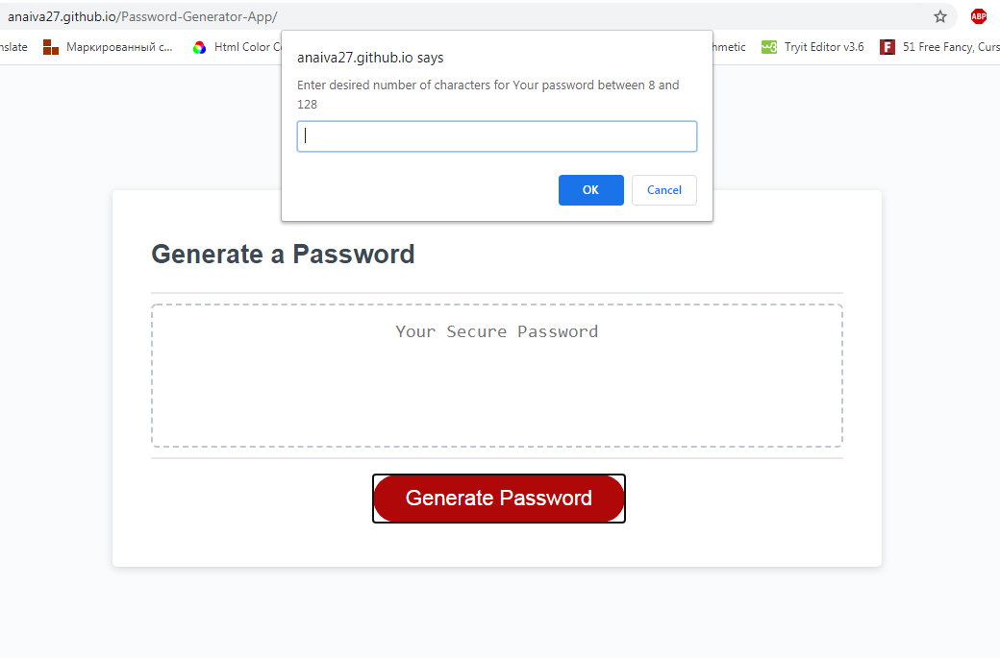
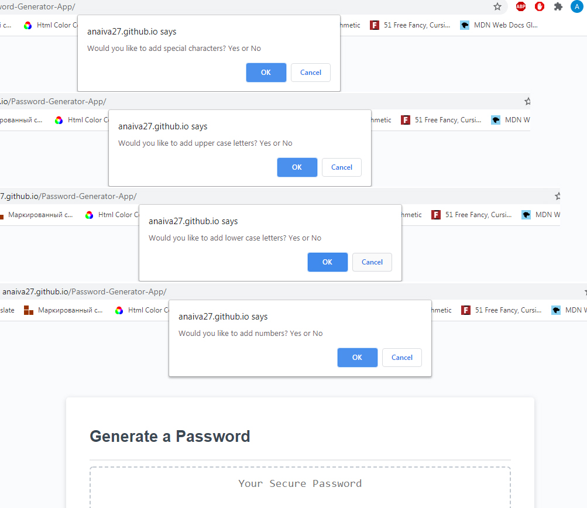
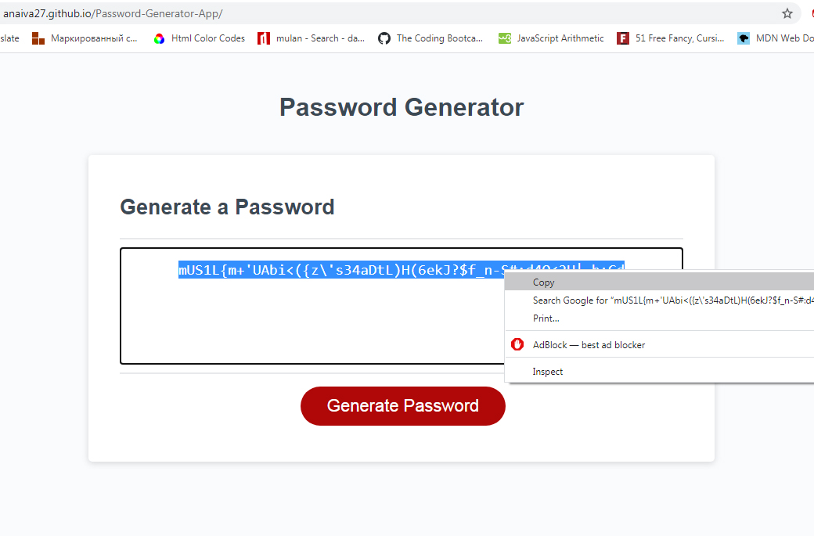

# Password Generator App

## Description 

The client had requested an application, that generates a secure password with custom length and characters of his choice, with a great usability, easy to navigate and to follow the instructions.

## Table of Contents

* [Installation](#installation)
* [Usage](#usage)
* [Links](#links)
* [Credits](#credits)

## Installation

For this task we needed to unstall the VS Code programm and use Google Chrome to test our project, using its Developer tools.

## Usage

With the world wide web growing exponentially, we need to make sure that our private data is safe from hackers, who's numbers are also have been growing at a fast pace. Due to this, it's very important to not just have some custom password protecting your devices, but to have a strong reliable one, so the malware couldn't get through. 
To fullfill these requirements, we have created an easy to use, functional application that randomly picks characters according to clients choice. 
First, we have created a file structure with the index page, that contains an epmty field for the password, that will be generated after the client will click on the button "Generate Pasword". Then he will be presented with a question about the length of the password. If the client decides to cancel the execution at that moment, the dialog window will dissapear and he will be able to start over.  
After indicating the criterias that he wants to add, the client receives a password. Once the functions in the file have had been executed, the application will retrieve a series of random numbers and characters from the ASCII code, that would be very difficult to hack.

Attached below the screenshots of the working applicaton, that is deployed at live URL and loads with no errors. 
First dialog window:  

The client chooses what types of characters he wants in his password: 

The password is generated and ready to be copied. 

## Links

[Password generator](https://anaiva27.github.io/Password-Generator-App/)  
[GitHub repository](https://github.com/anaiva27/Password-Generator-App)

## Credits

Useful articles about Javascript functions, statements and loops and implemention of the ASCII codes: 
[Use of charcodes](https://www.w3schools.com/jsref/jsref_fromcharcode.asp) 
[CodeAcademy. Functions](https://www.codecademy.com/learn/introduction-to-javascript/modules/learn-javascript-functions) 
[Javascript Objects and math](https://developer.mozilla.org/en-US/docs/Web/JavaScript/Reference/Global_Objects/Math/random) 

